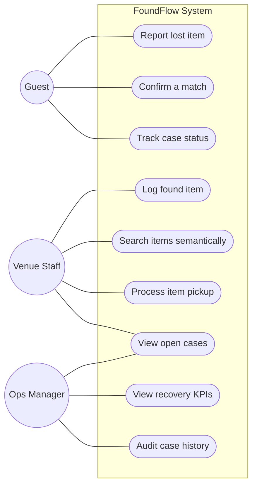
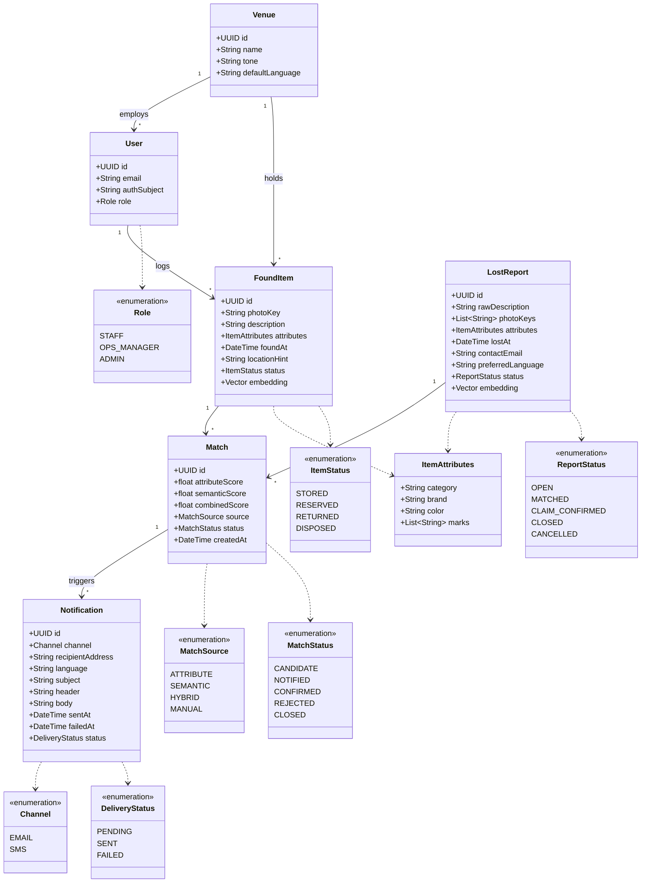
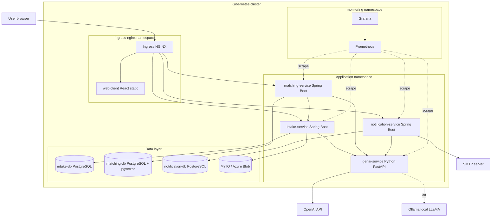

# FoundFlow — System Overview & Architecture

**Course:** DevOps: Engineering for Deployment and Operations (CIT423001)
**Team:** Chaos Monkeys
**Document deadline:** 08.05.2026
**Companion document:** [`problem-statement.md`](./problem-statement.md)

---

## 1. System Structure

### 1.1 Technology Choices

| Layer | Technology | Notes |
|---|---|---|
| Client | **React** (Vite, TypeScript) | Single-page app, served statically; consumes generated TypeScript SDK from OpenAPI |
| Backend services | **Spring Boot 3 (Java 21)** | Three microservices: `intake-service`, `matching-service`, `notification-service` |
| GenAI service | **Python 3.12 + FastAPI** | Stateless; model adapter for OpenAI cloud API and local LLaMA via Ollama (config-switched) |
| Database | **PostgreSQL 16** | One service-owned database per Spring service. `pgvector` extension in the matching database for embedding storage |
| Object storage | **MinIO** locally; Azure Blob in cloud | Used for found-item photos |
| SMTP | **Mailpit** locally; Azure Communication Services in cloud | For guest pickup notifications |
| Inter-service comms | REST/JSON over HTTP | Synchronous; no message broker in the course version (deliberate scope decision — see §4) |
| API contract | **OpenAPI 3.1** | Single `api/openapi.yaml`; Spring stubs, Python client, and TS SDK generated from it |
| Containerisation | Docker + docker-compose | `docker compose up` runs the system end-to-end locally |
| Orchestration | Kubernetes via **Helm** | Deployed to Rancher (course infra) and Azure |
| CI/CD | **GitHub Actions** | Build + test on PR; image build + deploy on merge to `main` |
| Observability | **Prometheus + Grafana** | Spring Boot Actuator + Micrometer; `prometheus_client` for the Python service |
| Infrastructure | **Ansible + Terraform** | Terraform for infrastructure provisioning and Ansible for Configuration Management.
### 1.2 Microservice Decomposition

The backend is split into three Spring Boot services with narrow responsibilities and a single owned data domain each. The GenAI service runs as a peer.

| Service | Owns | Talks to |
|---|---|---|
| `intake-service` | `lost_reports`, `found_items`, photo references | `genai-service` (sync, for attribute extraction); emits domain events to `matching-service` |
| `matching-service` | `matches` (candidate pairs, scores, status) | `intake-service` (reads items/reports); `genai-service` (sync, for embeddings and semantic search) |
| `notification-service` | `notifications` (sent log), guest contact info, message templates | `matching-service` (consumes confirmed matches); `genai-service` (sync, for message generation); SMTP |
| `genai-service` (Python) | nothing persistent (stateless) | Outbound to OpenAI API or local Ollama; reads/writes embeddings via `matching-service` |

"Domain events" in the course version are simple HTTP calls between services (e.g. `matching-service` polls or is poked by `intake-service` after each new item). A real broker (Kafka, RabbitMQ) is out of scope.

### 1.3 Data Storage

- **PostgreSQL** with database-level service ownership: `intake-service`, `matching-service`, and `notification-service` each use their own database and database user. Services do not share schemas or read each other's tables directly.
- **pgvector** extension in the `matching-service` database, used for embedding similarity. Vectors are produced by `genai-service` and persisted in the matching database alongside the match/search index, referenced to intake records by ID.
- **Object storage** (MinIO/Azure Blob) holds photos. Services store only the object key, not the photo bytes.
- **Database migrations** managed with Flyway, one migration history per service-owned database.

### 1.4 Configuration & Secrets

- Configuration via environment variables — no hardcoded credentials anywhere.
- Local: `.env` files (gitignored) consumed by docker-compose.
- Kubernetes: `ConfigMap` for non-secret config, `Secret` for credentials; populated through CI from GitHub repository secrets.
- The GenAI provider switch (`GENAI_PROVIDER=openai|local`) is the canonical example: same code path, swapped at deploy time.

### 1.5 Observability

- All Spring services expose `/actuator/prometheus` via Micrometer.
- The Python service exposes `/metrics` via `prometheus_client`.
- Tracked metrics across services: request count, request latency, error rate, plus domain metrics (matches per minute, GenAI extraction latency, vector search latency).
- Grafana dashboards committed as JSON under `infra/grafana/dashboards/`.
- At least one alert rule (e.g. service-down or 5xx rate > 1% over 5 min) configured in Prometheus.

---

## 2. Subsystem Ownership

| Subsystem | Owner | Scope |
|---|---|---|
| Frontend | **Arthur** | React client, public lost-item form, staff app, ops dashboard, frontend tests |
| Backend (Spring services) | **Johannes** | The three Spring Boot services, API design, OpenAPI spec authority, service-owned Postgres databases, backend tests |
| GenAI service | **Luca** | Python service, model adapter, embedding pipeline, RAG retrieval, prompt engineering, GenAI tests |

CI/CD, Kubernetes manifests, and observability are shared cross-team responsibilities. Each member is expected to have a primary cross-cutting concern (suggested: Johannes — CI; Arthur — K8s/Helm; Luca — observability).

---

## 3. UML Diagrams

> Diagrams are authored in Mermaid for inline review and version control. Final exports for the formal submission (if requested) will be re-drawn in [Apollon](https://apollon.ase.in.tum.de/).

### 3.1 Use Case Diagram

Three actors interact with the system: **Guest** (end user), **Venue Staff** (front-line operator), and **Operations Manager** (oversight). The GenAI service is a supporting actor invoked by the Spring services; it is not directly user-facing.

### 3.2 Analysis Object Model

Domain entities and their relationships. `ItemAttributes` is a value object embedded in both `LostReport` and `FoundItem` — populated by the GenAI service for reports, by staff input for items.

`User` represents an authenticated staff/ops/admin profile, not a guest. Credentials are handled by the auth/JWT layer, so the domain model does not store a plain password. If local login is implemented, only a password hash belongs in the persistence model. `authSubject` links the user profile to the JWT subject.

`LostReport.photoKeys` is optional supporting evidence from the guest. Found-item photos remain mandatory for staff intake, while lost-report photos are useful for manual verification and disambiguation. Image-based attribute extraction is out of scope for this iteration.

Match scoring keeps the two matching signals separate: `attributeScore` comes from structured `ItemAttributes`, `semanticScore` comes from vector similarity over descriptions, and `combinedScore` is the ranking score shown to staff. `combinedScore` is not a calibrated probability; it is a service-level score derived from the matching weights.

### 3.3 Top-Level Architecture (Component Diagram)

Components, their deployment grouping, and the principal data/control flows. The Kubernetes ingress is the single externally exposed entrypoint.

---

## 4. Risks

- **Local-LLM quality drift.** Prompts that work on OpenAI may produce malformed output on the local model. Mitigation: golden-set tests against both providers in CI starting in week 2, JSON-schema-constrained outputs.
- **K8s + observability ramp-up.** Only 1 team member has deep Kubernetes/Prometheus experience. Mitigation: plan knowledge sharing sessions; keep Helm charts simple.
- **API contract drift.** With three Spring services + frontend + Python client, the OpenAPI spec is the contract. Mitigation: pre-commit lint, codegen on every spec change, no in-line DTOs.
- **Demo data.** A working system with no realistic data looks broken. Mitigation: synthetic seed of ~200 items + 50 lost reports committed as per-service SQL fixtures, loaded on dev/demo deploys.
- **Photo storage decision drift.** MinIO locally and Blob in cloud — the abstraction has to actually be one interface. Mitigation: define the photo-storage interface in `intake-service` before either implementation lands.
