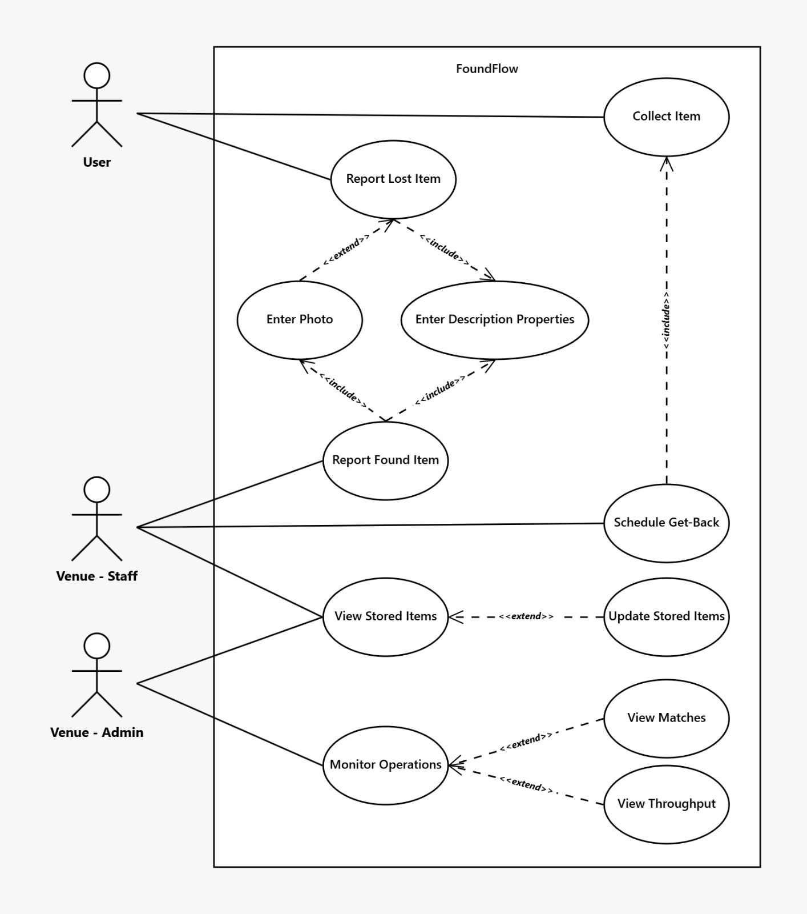
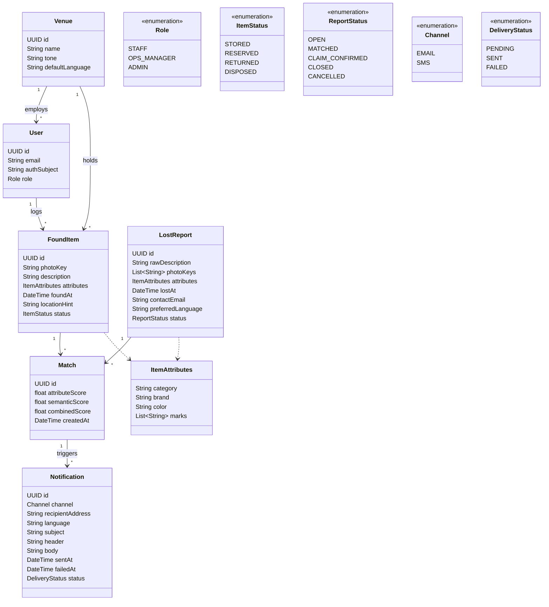
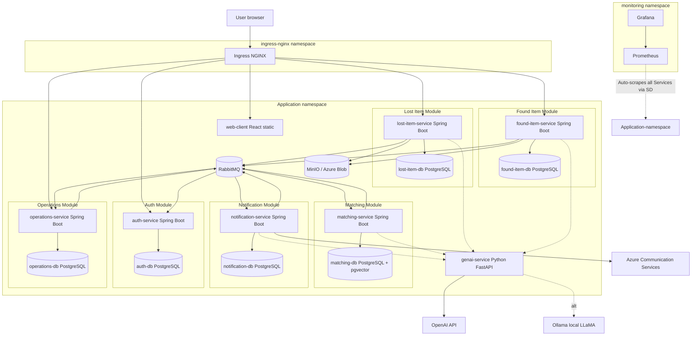

# FoundFlow — System Overview & Architecture

**Course:** DevOps: Engineering for Deployment and Operations (CIT423001)
**Team:** Chaos Monkeys
**Document deadline:** 08.05.2026
**Companion document:** [`problem-statement.md`](./problem-statement.md)

---

## 1. System Structure

### 1.1 Technology Choices

| Layer | Technology | Notes |
|---|---|---|
| Client | **React** (Vite, TypeScript) | Single-page app, served statically; consumes generated TypeScript SDK from OpenAPI |
| Backend services | **Spring Boot 3 (Java 21)** | Six microservices: `lost-item-service`, `found-item-service`, `matching-service`, `notification-service`, `auth-service`, `operations-service` |
| GenAI service | **Python 3.12 + FastAPI** | Stateless; model adapter for OpenAI cloud API and local LLaMA via Ollama (config-switched) |
| Database | **PostgreSQL 16** | One service-owned database per Spring service. `pgvector` extension in the matching database for embedding storage |
| Object storage | **MinIO** locally; Azure Blob in cloud | Used for found-item and lost-report photos |
| Notifications | **Mailpit** locally; Azure Communication Services in cloud | For guest pickup notifications |
| Message broker | **RabbitMQ** | Domain events between services, e.g. item intake, match candidates, notifications, and case status changes |
| Inter-service comms | REST/JSON over HTTP + RabbitMQ events | REST for direct reads/commands and GenAI calls; RabbitMQ for asynchronous domain workflows |
| API contract | **OpenAPI 3.1** | Single `api/openapi.yaml`; Spring stubs, Python client, and TS SDK generated from it |
| Containerisation | Docker + docker-compose | `docker compose up` runs the system end-to-end locally |
| Orchestration | Kubernetes via **Helm** | Deployed to Rancher (course infra) and Azure |
| CI/CD | **GitHub Actions** | Build + test on PR; image build + deploy on merge to `main` |
| Observability | **Prometheus + Grafana** | Spring Boot Actuator + Micrometer; `prometheus_client` for the Python service |
| Infrastructure | **Ansible + Terraform** | Terraform for infrastructure provisioning and Ansible for Configuration Management. |
### 1.2 Microservice Decomposition

The backend is split into six Spring Boot services with narrow responsibilities and a single owned data domain each. The GenAI service runs as a peer. RabbitMQ carries domain events so intake, matching, notification, and operations workflows are not coupled through synchronous call chains.

| Service | Owns | Talks to |
|---|---|---|
| `lost-item-service` | `lost_reports`, guest contact reference, optional lost-report photo references | `genai-service` (sync, for attribute extraction and embeddings); publishes lost-report events to RabbitMQ |
| `found-item-service` | `found_items`, found-item photo references, item custody status | `genai-service` (sync, for embeddings); publishes found-item events to RabbitMQ |
| `matching-service` | `matches` (candidate pairs, scores, status), vector search index | RabbitMQ (consumes lost/found item events, publishes match events); `genai-service` (sync, for semantic search support); lost/found services (REST reads when details are needed) |
| `notification-service` | `notifications` (sent log), delivery state, rendered outbound messages | RabbitMQ (consumes match/claim events); `genai-service` (sync, for message generation); SMTP |
| `auth-service` | staff/ops/admin credentials, sessions or refresh tokens, JWT issuance, auth subjects | Frontend and ingress-protected APIs; `operations-service` for profile lookup by auth subject |
| `operations-service` | staff/ops user profiles, venue configuration, KPI read models, audit timeline | RabbitMQ (consumes domain events to build operational views); `auth-service` (identity); other services through REST for drill-down details |
| `genai-service` (Python) | nothing persistent (stateless) | Outbound to OpenAI API or local Ollama; reads/writes embeddings via `matching-service` |

RabbitMQ is the broker for durable domain events. The core event stream includes `LostReportCreated`, `FoundItemLogged`, `MatchCandidateCreated`, `MatchConfirmed`, `NotificationSent`, and `CaseClosed`. Services still expose REST APIs for user-facing commands and query/detail reads, but event-driven flows handle background work and operational projections.

### 1.3 Data Storage

- **PostgreSQL** with database-level service ownership: each Spring service uses its own database and database user. Services do not share schemas or read each other's tables directly.
- **pgvector** extension in the `matching-service` database, used for embedding similarity. Vectors are produced by `genai-service` and persisted in the matching database alongside the match/search index, referenced to intake records by ID.
- **Object storage** (MinIO/Azure Blob) holds photos. Services store only the object key, not the photo bytes.
- **RabbitMQ** stores transient event queues and dead-letter queues. It is not the system of record; PostgreSQL remains authoritative for service state.
- **Database migrations** managed with Flyway, one migration history per service-owned database.

### 1.4 Configuration & Secrets

- Configuration via environment variables — no hardcoded credentials anywhere.
- Local: `.env` files (gitignored) consumed by docker-compose.
- Kubernetes: `ConfigMap` for non-secret config, `Secret` for credentials; populated through CI from GitHub repository secrets.
- The GenAI provider switch (`GENAI_PROVIDER=openai|local`) is the canonical example: same code path, swapped at deploy time.

### 1.5 Observability

- All Spring services expose `/actuator/prometheus` via Micrometer.
- The Python service exposes `/metrics` via `prometheus_client`.
- Tracked metrics across services: request count, request latency, error rate, plus domain metrics (matches per minute, GenAI extraction latency, vector search latency).
- Grafana dashboards committed as JSON under `infra/grafana/dashboards/`.
- At least one alert rule (e.g. service-down or 5xx rate > 1% over 5 min) configured in Prometheus.

---

## 2. Subsystem Ownership

| Subsystem | Owner | Scope |
|---|---|---|
| Frontend | **Arthur** | React client, public lost-item form, staff app, ops dashboard, frontend tests |
| Backend (Spring services) | **Johannes** | Spring Boot services, API design, OpenAPI spec authority, service-owned Postgres databases, backend tests |
| GenAI service | **Luca** | Python service, model adapter, embedding pipeline, RAG retrieval, prompt engineering, GenAI tests |

CI/CD, Kubernetes manifests, and observability are shared cross-team responsibilities. Each member is expected to have a primary cross-cutting concern (suggested: Johannes — CI; Arthur — K8s/Helm; Luca — observability).

---

## 3. UML Diagrams

> Diagrams are authored in Mermaid for inline review and version control. Final exports for the formal submission (if requested) will be re-drawn in [Apollon](https://apollon.ase.in.tum.de/).

### 3.1 Use Case Diagram

Three actors interact with the system: **User** (guest/end user), **Venue Staff** (front-line operator), and **Venue Admin** (operational oversight). The GenAI service is a supporting service invoked by the backend; it is not directly user-facing.

### 3.2 Analysis Object Model

Domain entities and their relationships. `ItemAttributes` is a value object embedded in both `LostReport` and `FoundItem` — populated by the GenAI service for reports, by staff input for items.

`User` represents a staff/ops/admin profile, not a guest. Credentials, login state, refresh tokens, and JWT issuance belong to `auth-service`; the profile record belongs to `operations-service`. `authSubject` links the operational user profile to the authenticated identity.

`LostReport.photoKeys` is optional supporting evidence from the guest. Found-item photos remain mandatory for staff intake, while lost-report photos are useful for manual verification and disambiguation. Image-based attribute extraction is out of scope for this iteration.

Match scoring keeps the two matching signals separate: `attributeScore` comes from structured `ItemAttributes`, `semanticScore` comes from vector similarity over descriptions, and `combinedScore` is the ranking score shown to staff. `combinedScore` is not a calibrated probability; it is a service-level score derived from the matching weights.

The model omits UML access modifiers and methods because it is an analysis object model focused on domain concepts and relationships, not an implementation-level Java class design.

### 3.3 Top-Level Architecture (Component Diagram)

Components, their deployment grouping, and the principal data/control flows. The Kubernetes ingress is the single externally exposed entrypoint.

---

## 4. Risks

- **Local-LLM quality drift.** Prompts that work on OpenAI may produce malformed output on the local model. Mitigation: golden-set tests against both providers in CI starting in week 2, JSON-schema-constrained outputs.
- **K8s + observability ramp-up.** Only 1 team member has Kubernetes/Prometheus experience. Mitigation: plan knowledge sharing sessions; keep Helm charts simple.

- **API contract drift.** With six Spring services + frontend + Python client, the OpenAPI spec is the contract for synchronous APIs. Mitigation: pre-commit lint, codegen on every spec change, no in-line DTOs.
- **Event contract drift.** RabbitMQ decouples services but can hide breaking message-shape changes. Mitigation: version domain events, document event payloads next to the OpenAPI spec, and add consumer contract tests for core flows.
- **Demo data.** A working system with no realistic data looks broken. Mitigation: synthetic seed of ~200 items + 50 lost reports committed as per-service SQL fixtures, loaded on dev/demo deploys.
- **Photo storage decision drift.** MinIO locally and Blob in cloud — the abstraction has to actually be one interface. Mitigation: define the photo-storage interface shared by `lost-item-service` and `found-item-service` before either implementation lands.
