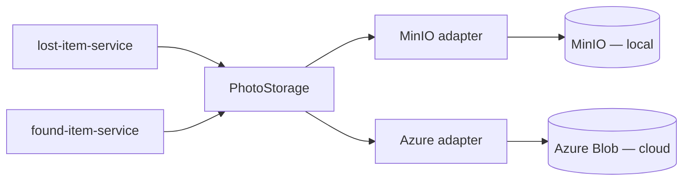

# FoundFlow — Photo Storage

**Companion to** [`architecture.md`](./architecture.md) — §1.3 (data storage), §3.2 (domain model), §4 (risks).
**Status:** design contract for issue #67. Implemented by #28 (`lost-item-service`) and #29 (`found-item-service`).

---

## Purpose & Scope

FoundFlow keeps item photos in object storage — **MinIO** in local compose, with **Azure Blob** as the planned cloud target. Two services attach photos to their records:

- `lost-item-service` — an **optional, single** guest photo per lost report.
- `found-item-service` — a **mandatory** staff photo per found item.

`architecture.md` §4 records the risk this document closes: *"MinIO locally and Blob in cloud — the abstraction has to actually be one interface."* Without a shared contract the two services drift into two incompatible storage implementations.

This document **is** that contract. It defines one interface, the object-key format, the backend-selection mechanism, and the validation rules — enough that `lost-item-service` and `found-item-service` can be built against an identical abstraction with no backend-specific code in either.

The current implementation provides the shared module, MinIO and Azure adapters, a filesystem adapter for lightweight tests/local fallback, compose wiring, upload/download endpoints, and signed-URL generation. The Azure adapter is wired through the same `PhotoStorage` interface and `PHOTO_STORAGE_PROVIDER=azure` switch; integration testing against a live Azure account is still pending.

**Foundational rule** (`architecture.md` §1.3): **services persist only the object key, never the photo bytes.** The `photoKey` column already exists on `lost_reports` and `found_items` (`VARCHAR(255)`, nullable — Flyway `V1__init.sql`). This abstraction produces that key on upload and resolves it on read.

## 1. The `PhotoStorage` interface

One Java interface, in pure Java — no Spring types, no JPA, no backend SDK types in any signature — so both services depend on the same abstraction and no business-logic path branches on the backend.

```java
package com.foundflow.photo.storage;

import java.io.InputStream;
import java.net.URI;
import java.time.Duration;

public interface PhotoStorage {

    /** Store a new photo. Returns the generated object key (§3). */
    String store(PhotoData photo);

    /** Open a stored photo for reading; the caller closes the stream.
     *  Throws PhotoNotFoundException if the key is unknown. */
    PhotoData retrieve(String photoKey);

    /** A time-limited URL with which a browser GETs the photo directly
     *  from the backing store. Throws PhotoNotFoundException if unknown. */
    URI signedUrl(String photoKey, Duration ttl);

    /** Remove a photo. Idempotent — deleting an absent key is a no-op. */
    void delete(String photoKey);
}
```

`PhotoData` is the transfer type carrying the bytes plus the metadata needed to store and to serve them:

```java
public record PhotoData(InputStream content, String contentType, long sizeBytes) {}
```

`PhotoData` is single-use — its `InputStream` is consumed once (by the adapter in `store`, by the caller in `retrieve`). It is not a persistent value object.



The interface is deliberately small. It does **not** validate formats, enforce size limits, count photos per record, or convert images — those are service-layer policy (§4, §6) or upstream concerns. It stores and retrieves opaque bytes addressed by an opaque key.

**Retrieval has two paths.** `signedUrl(...)` is the primary one: the service hands the browser a short-lived URL (a short TTL — on the order of 5–15 minutes — is appropriate) and the bytes travel straight from MinIO/Azure to the browser, never through the service. `retrieve(...)` is the service-proxied fallback — the service streams the bytes itself — for internal use or where a direct URL is unsuitable.

> **Environment caveat.** A signed URL embeds the backing store's own host. An Azure Blob SAS URL is internet-reachable. A MinIO URL points at the MinIO endpoint, which the **browser** must be able to resolve — so MinIO must be presigned with a host-reachable endpoint (`localhost:9000`, §5), not the in-cluster or compose service name. Where a browser-reachable URL cannot be guaranteed, use `retrieve(...)` instead.

## 2. Module layout

The interface, `PhotoData`, and the exceptions (§7) live in a new Gradle module **`shared/photo-storage`** (artifact `com.foundflow:photo-storage`), consumed by both services as a composite build — the mechanism `shared/common-domain` already uses.

**Why a new module, not an addition to `common-domain`.** `common-domain` exists to hold JPA value objects and exposes `jakarta.persistence` on its `api` configuration. Storage has nothing to do with persistence; placing it there would force JPA onto every storage consumer and blur the module's responsibility. Separating the two is not about minimising dependencies — it is about each shared module owning one coherent concern.

```
shared/
  common-domain/      # existing — JPA value objects (ItemAttributes)
  photo-storage/      # new — the storage contract
    settings.gradle   # rootProject.name = 'photo-storage'
    build.gradle      # id 'java-library'; group 'com.foundflow'; NO jakarta.persistence
    src/main/java/com/foundflow/photo/storage/
```

Each consuming service wires it in exactly as it already wires `common-domain`:

```gradle
// services/<name>/settings.gradle
includeBuild('../../shared/photo-storage')

// services/<name>/build.gradle  →  dependencies { }
implementation 'com.foundflow:photo-storage:0.0.1-SNAPSHOT'
```

The MinIO and Azure **adapters** and the provider-selecting Spring auto-configuration (§5) live in this same module — they are all "photo storage", and co-locating them means the two services share one implementation rather than duplicating adapters. The module therefore depends on the MinIO and Azure SDKs and on Spring Boot auto-configuration; all are appropriate to a storage module. The one inviolable rule: **service business logic depends only on the `PhotoStorage` type** — never on an adapter, an SDK, or a provider name.

## 3. Object key naming

Format:

```
{domain}/{yyyy}/{MM}/{uuid4}.{ext}
```

| Segment | Meaning |
|---|---|
| `{domain}` | `lost-reports` or `found-items` — makes a bare key self-identifying (and namespaces the services should a bucket ever be shared) |
| `{yyyy}/{MM}` | upload year / month — cheap partitioning for browsing and lifecycle rules |
| `{uuid4}` | random UUIDv4 — collision-free with no coordination |
| `{ext}` | `jpg`, `png`, or `webp`, derived from the validated content type (§6) |

Example: `found-items/2026/05/8e1f9c02-7d34-4a1b-9f2e-1c6b0a5d3e77.jpg`

Properties:

- **Environment-independent.** The key encodes neither environment nor bucket. Environment is chosen by configuration (§5); the same key resolves anywhere it is pointed at the same data.
- **Opaque to services.** A service treats the key as a string — it neither builds nor parses it, beyond the cheap `{domain}`-prefix check in §4.
- **Stable.** A key is assigned once, at `store()`, and never changes.

The key does **not** embed the owning record's id. The link runs the other way: the `lost_reports` / `found_items` row stores the `photoKey`. This keeps `store()` independent of record-creation order. The format is about 60 characters — well within the existing `VARCHAR(255)` column.

## 4. Key generation vs. validation

#67 calls for stating which side generates keys and which validates them.

**Generation — the storage adapter, never a service.** `store()` builds the key (§3) and returns it; neither service constructs keys. This is what makes naming uniform across both services *by construction* — the "actually one interface" requirement. The `{domain}` segment is a fixed configuration property of each service's `PhotoStorage` component (`lost-reports` for one, `found-items` for the other), so `store()` itself takes no domain argument.

**Validation — split by concern:**

- **Format and existence — the storage adapter.** A malformed key, or a well-formed key with no object behind it, produces `PhotoNotFoundException` from `retrieve` / `signedUrl`.
- **Ownership — the owning service.** Before serving a photo, the service confirms the `photoKey` is the one recorded on one of *its own* rows, and that the key's `{domain}` prefix matches its own domain. A service never serves a photo for a key taken directly from a request — only the key stored on a record the caller is authorised to see. This stops a caller from coaxing a service into vending an unrelated photo by passing an arbitrary key.

## 5. Configuration switch

The backend is selected at startup from one variable; no business-logic code branches on it.

```
PHOTO_STORAGE_PROVIDER = minio | azure | local
PHOTO_STORAGE_SIGNED_URL_TTL = PT10M
```

This mirrors the `GENAI_PROVIDER` switch — `architecture.md` §1.4 calls that "the canonical example: same code path, swapped at deploy time."

| Variable | Provider | Secret | Purpose |
|---|---|---|---|
| `PHOTO_STORAGE_PROVIDER` | all | no | `minio`, `azure`, or `local` |
| `PHOTO_STORAGE_SIGNED_URL_TTL` | minio/azure | no | ISO-8601 duration for signed URL validity, defaults to `PT10M` |
| `PHOTO_STORAGE_ENDPOINT` | minio | no | Internal S3 endpoint used by services for store/retrieve |
| `PHOTO_STORAGE_PUBLIC_ENDPOINT` | minio | no | Browser-reachable S3 endpoint embedded into signed URLs |
| `PHOTO_STORAGE_ACCESS_KEY` | minio | **yes** | MinIO access key |
| `PHOTO_STORAGE_SECRET_KEY` | minio | **yes** | MinIO secret key |
| `PHOTO_STORAGE_BUCKET` | minio | no | this service's bucket |
| `PHOTO_STORAGE_CONNECTION_STRING` | azure | **yes** | Azure Blob account connection string |
| `PHOTO_STORAGE_CONTAINER` | azure | no | this service's container |
| `PHOTO_STORAGE_LOCAL_ROOT` | local | no | Filesystem root for lightweight local/test storage |

A Spring auto-configuration in `shared/photo-storage` (`PhotoStorageAutoConfiguration`) reads `PHOTO_STORAGE_PROVIDER` and produces the matching adapter as the `PhotoStorage` bean. Business logic injects `PhotoStorage` and is identical for all backends — services set only `photo-storage.domain` in their `application.properties`.

**One bucket / storage root per service.** `lost-item-service` and `found-item-service` each own a separate bucket (MinIO) or storage root (local) — e.g. `foundflow-lost-photos` and `foundflow-found-photos`. This mirrors the per-service data-ownership rule (`architecture.md` §1.3) and lets each service's credentials be scoped to only its own store.

**Local — docker-compose.** A `minio` service is added to `docker-compose.yml` with a persistent volume; credentials come from the gitignored `.env`. Illustrative — added by #28 / #29, not #67:

```yaml
# docker-compose.yml
  minio:
    image: minio/minio:RELEASE.YYYY-MM-DDTHH-MM-SSZ   # pin a current release
    container_name: foundflow-minio
    command: server /data --console-address ":9001"
    ports:
      - "9000:9000"   # S3 API — must be host-reachable for presigned URLs
      - "9001:9001"   # web console
    environment:
      MINIO_ROOT_USER: ${PHOTO_STORAGE_ACCESS_KEY:?PHOTO_STORAGE_ACCESS_KEY is required}
      MINIO_ROOT_PASSWORD: ${PHOTO_STORAGE_SECRET_KEY:?PHOTO_STORAGE_SECRET_KEY is required}
    volumes:
      - minio-data:/data
    # TODO (#28/#29): healthcheck on GET /minio/health/live

volumes:
  minio-data:
```

`.env.example` gains, in the project's existing style:

```
# --- Photo storage (object store) -------------------------------------------
# Provider switch: `minio` runs against the bundled MinIO container.
PHOTO_STORAGE_PROVIDER=minio
PHOTO_STORAGE_ENDPOINT=http://localhost:9000
PHOTO_STORAGE_PUBLIC_ENDPOINT=http://localhost:9000
PHOTO_STORAGE_ACCESS_KEY=foundflow
PHOTO_STORAGE_SECRET_KEY=foundflow_dev_secret
```

**Cloud — Kubernetes / Helm.** Non-secret values (`PHOTO_STORAGE_PROVIDER`, endpoint, bucket/container names) go in a `ConfigMap`; provider credentials (`PHOTO_STORAGE_SECRET_KEY`, `PHOTO_STORAGE_CONNECTION_STRING`) go in a `Secret` populated from GitHub repository secrets through CI (`architecture.md` §1.4). Both adapters share the same interface, so switching MinIO → Azure is a configuration change — no image rebuild, no code change.

## 6. Content-type & size constraints

Each service enforces these at its upload endpoint, *before* calling `store()`. They are documented here so both services enforce them identically; the storage layer itself is format-agnostic.

| Constraint | Value |
|---|---|
| Allowed content types | `image/jpeg`, `image/png`, `image/webp` |
| Maximum size | 10 MB per photo |
| Minimum size | non-empty — reject 0 bytes |
| Photos per lost report | 0 or 1 — optional (`architecture.md` §3.2) |
| Photos per found item | exactly 1 — mandatory (`architecture.md` §3.2) |

A rejected upload returns `415 Unsupported Media Type` (content type) or `413 Payload Too Large` (size) — and never reaches storage.

**HEIC.** iPhone cameras default to HEIC, which Chrome, Firefox, and most email clients cannot render — and FoundFlow *displays* these photos (the staff app; the guest pickup email). HEIC is therefore not a stored format. It is **not** rejected at the user's expense: the upload path transcodes HEIC → JPEG *before* upload, so a guest is never shown an error for using their phone's default. That conversion belongs in the **frontend** report/intake form (client-side — e.g. a WASM decoder such as `heic2any`), which has the original file and can give immediate feedback. Server-side conversion is deliberately avoided — Java-side HEIC decoding needs native libraries, and image processing does not belong in a storage layer. This is a cross-ticket dependency for the frontend upload work alongside #28 / #29.

## 7. Error handling

`shared/photo-storage` defines a small unchecked exception hierarchy:

```java
package com.foundflow.photo.storage;

public class PhotoStorageException extends RuntimeException { /* base */ }

public class PhotoNotFoundException extends PhotoStorageException { /* unknown key */ }
```

| Situation | Interface behaviour | Service maps to |
|---|---|---|
| `retrieve` / `signedUrl`, unknown key | throws `PhotoNotFoundException` | `404 Not Found` |
| `signedUrl`, local filesystem backend | throws `UnsupportedOperationException` | `501 Not Implemented` |
| `delete`, unknown key | no-op | `204 No Content` |
| Backend unreachable / store failure | throws `PhotoStorageException` | `502` / `503` |
| Upload fails §6 validation | never reaches storage | `413` / `415` |

`delete` is idempotent by contract — deleting an absent photo is a successful no-op, so retries and re-runs are safe. Exceptions are unchecked to keep the interface clean; each service translates them in its existing exception handler.

## 8. Implementation checklist (#28 / #29)

What the photo-handling tickets do, given this contract:

1. Create the `shared/photo-storage` module — `PhotoStorage`, `PhotoData`, the exceptions — and wire it into both services' `settings.gradle` / `build.gradle` (§2).
2. Implement the MinIO, Azure, and local-filesystem adapters and the `PHOTO_STORAGE_PROVIDER` auto-configuration (§5).
3. Add the `minio` service and volume to `docker-compose.yml`; add the `PHOTO_STORAGE_*` block to `.env.example` (§5).
4. Add upload and retrieval endpoints to each service — `multipart/form-data` upload, proxy download, and authorized `signedUrl` retrieval — enforcing the §6 constraints at the boundary.
5. Provision the per-service buckets / containers; add the cloud `ConfigMap` / `Secret` wiring to the Helm charts (§5).
6. Frontend: transcode HEIC → JPEG before upload (§6).
7. No migration needed — the `photoKey` column already exists (`V1__init.sql`).
